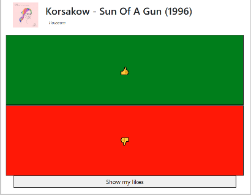

# PartyVoter

Incredibly easy python script to use on parties to let guests vote for the currently playing track. If the voting is negative, the current track will be skipped. Songs can be liked and a list of all liked songs can be accessed at any time.

## How it works

It works by hooking into the WinRT MediaManager (the thing you see when changing volume for example) using the python package `winsdk`. Using the media session, it can retrieve song properties such as `title`, `artist` and also the `thumbnail`.

To easily identify users, upon first visit on `/` (index) a cookie with a `uuid` is issued. This `uuid` is used to identify matching database objects and to store liked songs.

## Server side

It is **recommended** to create a virtual environment before installing the requirements!

To use the server execute the following:

```ps
pip install -r requirements.txt
```

You can then use the `run.bat` file which is merely a clickable wrapper around:

```ps
python run.py
```

### Backend

The database is a simple SQLite database, which is made sure to be created when the first user fetches the index of the server.

For a database reset it is sufficient to remove the `.db` file inside, or the complete `instance` folder.

## Client-Side

By default, users can connect to the server on port 8099. The layout is very simple:



Every user can vote once every x Seconds, so that the voting stays fair. By clicking on "Show my likes" the user is redirected to a page which displays all liked songs.

## Configuration

There is not a lot to configure. If you need to, you can change the default values in `run.py`:

```python
COOLDOWN_TIME_SECONDS = 15
MAX_DOWNVOTES = 3
SITE_NAME = "PartyVoter"
SERVER_PORT = 8099
SERVER_BIND = "0.0.0.0"
```

When using `SERVER_BIND=0.0.0.0`, the flask server will bind to a public socket, so that your server is available through your LAN.

In my case, I used a reverse proxy and `SERVER_BIND=0.0.0.0`, so that guests do not have to be connected to the WLAN in order to put votes.

## Liked songs

So that after the party everyone can enjoy the songs he liked, there is the `/liked` endpoint of the server. Using the same device it will display the liked songs connected to the unique id in the device cookie.
